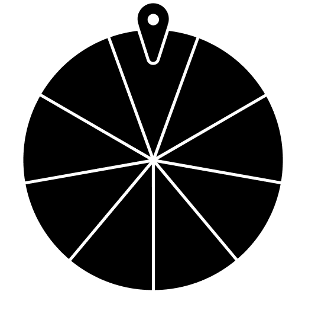
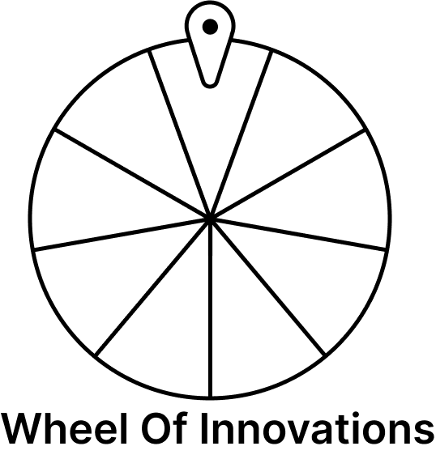
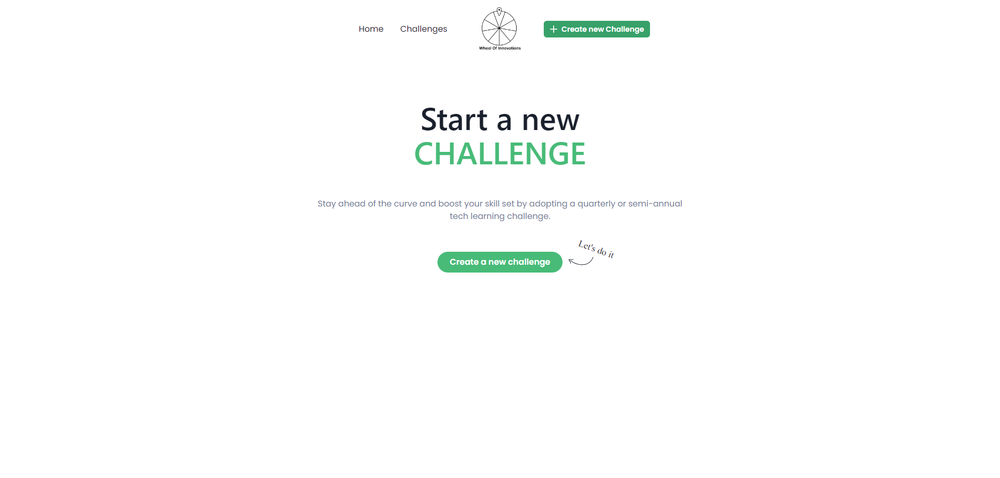
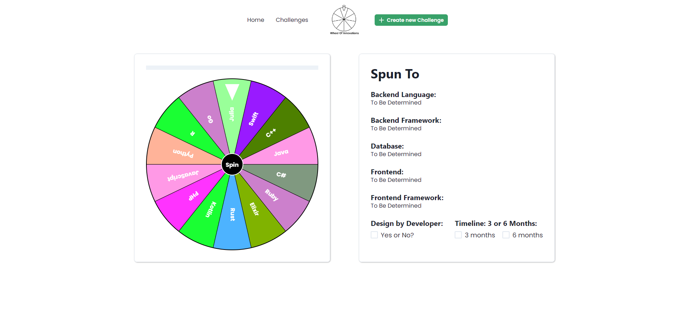
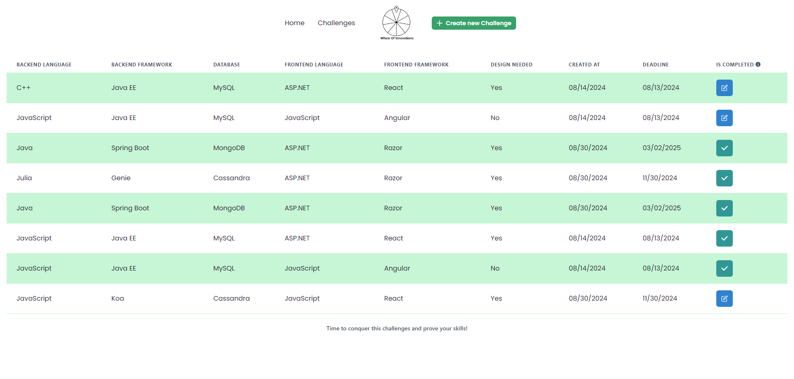

# WHEEL OF INNOVATIONS

<!-- PROJECT LOGO -->
<!-- markdownlint-disable -->
<div align="center" style="margin-top: 24px">
  
  
  <h3 align="center">A server, client and database application to train NestJS, Redis, TypeORM, Winston, React, TypeScript and Chakra UI.</h3>
</div>
<!-- markdownlint-disable -->

<!-- LAYOUT PREVIEW -->
## LAYOUT

### Home



### Create challenge



### List of challenges



<!-- GETTING STARTED -->
## Getting Started

This is an example of how you may give instructions on setting up your project locally.

### Installation

1. Clone the repo

   ```shell
   git clone git@github.com:allanfoppa/wheel-of-innovations.git
   ```

2. Run a docker compose file
   ```shell
   docker-compose up
   ```

3. Run a server command

   ```shell
   npm i # if first time
   npm run start:dev
   ```

4. Run a client command

   ```shell
   npm i # if first time
   npm run start
   ```

## INTENDED IMPROVEMENTS

- [ ] Filtrable table at list of challenges
- [ ] Create segmented challenges, like only backend project or frontend project
- [ ] Dark theme

## FINAL CONSIDERATIONS

This application is a practice project built to explore technologies and concepts. It's not intended for commercial use and may not adhere to best practices for production environments.
Feel free to explore, contribute, or provide feedback. Thank you for checking it out!
